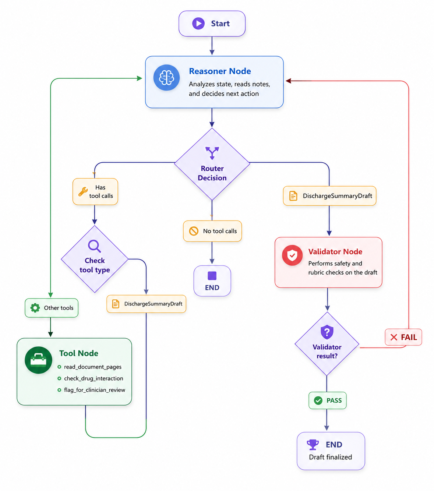
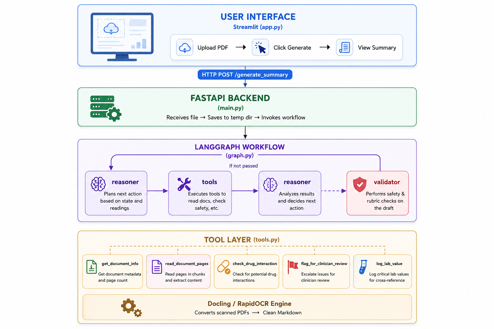
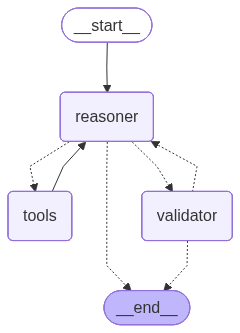
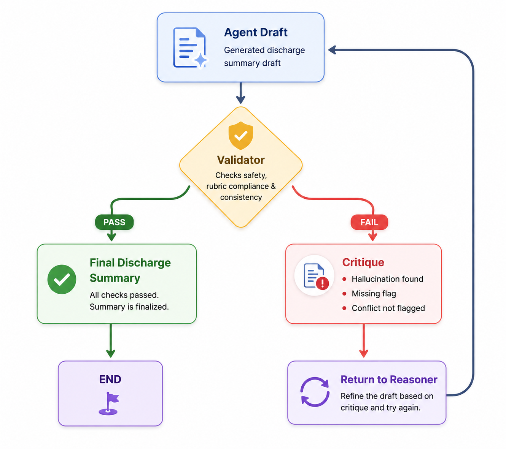

# 🏥 Discharge Agent

> **Assessment Part A** — Clinical AI Agent System

An **agentic, zero-hallucination discharge summary generator** powered by LangGraph, GPT-4o, and Docling OCR. The system reads multi-page handwritten/scanned medical PDFs, reasons over them in structured passes, validates outputs against a strict clinical rubric, and produces a structured, safe discharge summary.

---

<h2 align="center">High-Level Architecture</h2>

<p align="center">
  
</p>
---

## 📑 Table of Contents

- [Overview](#overview)
- [System Architecture](#system-architecture)
- [Agent Graph Flow](#agent-graph-flow)
- [Project Structure](#project-structure)
- [Core Components](#core-components)
- [Output Schema](#output-schema)
- [Safety & Validation Layer](#safety--validation-layer)
- [Setup & Installation](#setup--installation)
- [Running the Application](#running-the-application)
- [API Reference](#api-reference)
- [Design Decisions](#design-decisions)
- [Known Limitations](#known-limitations)

---

## Overview

This system processes real-world hospital patient records — including **handwritten nursing notes, ICU charts, lab reports, consultation sheets, and discharge summaries** — and distills them into a structured, clinically safe JSON discharge summary.

The agent operates under a **zero-hallucination guarantee**: if a data point cannot be confirmed from the source document, it is explicitly flagged as `[MISSING - FLAG FOR REVIEW]` rather than fabricated.

### Key Capabilities

| Capability | Description |
|---|---|
| 📄 **Multi-pass PDF Reading** | Reads documents in strategic 5-page chunks (front, back, middle) |
| 🧠 **Agentic Reasoning** | GPT-4o reasons, plans, and self-corrects using LangGraph |
| ✅ **Rubric Validation** | A separate validator node enforces clinical documentation rules |
| 💊 **Medication Reconciliation** | Compares admission vs discharge meds, flags Started/Stopped/Changed |
| ⚠️ **Conflict Detection** | Programmatic regex detects conflicting lab values across pages |
| 🚨 **Clinician Escalation** | Dangerous drug interactions and contradictions are formally logged |
| 🔁 **Self-Healing Loop** | Agent re-reads and retries if validation fails (up to 15 iterations) |

---

## System Architecture

<p align="center">
  
</p>
```

## 📄 Document Ingestion Pipeline

Medical records are inherently unstructured and often contain scanned pages, handwritten notes, laboratory reports, medication tables, and mixed layouts. Before any reasoning begins, the ingestion pipeline converts raw PDFs into structured Markdown using **Docling OCR**.

### Processing Flow

```text
PDF Document
      │
      ▼
Docling Converter
      │
      ├── OCR Extraction
      ├── Table Structure Detection
      ├── Layout Understanding
      └── Image Processing
      │
      ▼
Structured Markdown
      │
      ▼
Chunk-Based Reader
      │
      ▼
LangGraph Agent
```

### Implementation

The ingestion layer is implemented in `document_processor.py`.

```python
pipeline_options = PdfPipelineOptions()
pipeline_options.do_ocr = True
pipeline_options.do_table_structure = True
pipeline_options.generate_picture_images = True
pipeline_options.images_scale = 1.0

converter = DocumentConverter(
    format_options={
        InputFormat.PDF: PdfFormatOption(
            pipeline_options=pipeline_options
        )
    }
)
```

### Why Docling?

Traditional PDF parsers struggle with clinical documents because they often contain:

* Handwritten nursing notes
* Scanned discharge summaries
* Laboratory result tables
* Multi-column layouts
* Embedded images and forms

Docling combines OCR, layout analysis, and table extraction to produce a structured Markdown representation that preserves document semantics and improves downstream information extraction.

### OCR Output Format

After processing, each PDF is converted into structured Markdown that can be consumed by the agent.

```markdown
## Discharge Medications

| Medication | Dose | Frequency |
|------------|------|-----------|
| Oflox TZ   | 1 Tab | BID |
| Raciper    | 20 mg | OD |

## Laboratory Results

Haemoglobin: 11.4 g/dL
WBC Count: 12,300 /mm³
Platelets: 210,000 /mm³
```

### Chunk-Based Reading Strategy

Instead of loading an entire medical record into the context window, the agent reads documents strategically in **5-page chunks**:

1. **Front Pages** → Demographics, diagnoses, discharge medications
2. **Final Pages** → Admission medications, allergies, follow-up instructions
3. **Middle Pages** → Progress notes, laboratory results, hospital course

This approach reduces token usage while maximizing retrieval of clinically relevant information.

### Traceability & Debugging

Every extracted chunk is persisted as raw Markdown inside the `extraction_logs/` directory:

```text
extraction_logs/
├── patient_001_pages_1-5.md
├── patient_001_pages_16-20.md
└── patient_001_pages_8-12.md
```

These logs provide complete transparency into the OCR process and make it possible to audit exactly what information the agent used when generating a discharge summary.


## Agent Graph Flow

The LangGraph workflow implements a **Reason → Act → Validate → Repeat** loop:


<p align="center">
  
</p>
```

### Router Logic (`graph.py`)

The `router` function controls transitions:

1. **Iteration cap** — If `iteration_count >= 15`, force `END` to prevent infinite loops.
2. **Validator pass** — If `validator_critique == "PASS"`, the summary is finalized.
3. **Tool routing** — If the last message contains `DischargeSummaryDraft`, route to `validator`; otherwise route to `tools`.

---

## Project Structure

```
project/
│
├── agent/
│   ├── graph.py          # LangGraph workflow definition & router
│   ├── nodes.py          # reasoner() and validator() node logic
│   └── tools.py          # LangChain tools (PDF reading, drug checks)
│
├── schema/
│   ├── agent_state.py    # AgentState TypedDict (shared memory)
│   └── output_models.py  # Pydantic output schema (DischargeSummaryDraft)
│
├── ingestion/
│   └── document_processor.py   # Docling/OCR PDF-to-Markdown converter
│
├── extraction_logs/             # Auto-generated: raw OCR markdown per chunk
│
├── app.py                # Streamlit frontend
├── main.py               # FastAPI backend
└── .env                  # API keys (not committed)
```

---

## Core Components

### 1. `graph.py` — The Orchestrator

Builds the `StateGraph` and wires all nodes together. The `router` function is the decision-making hub that decides what happens after each `reasoner` call.

```python
workflow.add_conditional_edges(
    "reasoner", router, {"tools": "tools", "validator": "validator", END: END}
)
```

### 2. `nodes.py` — The Brain

Contains two nodes:

#### `reasoner(state)`
- Injects a structured **system prompt** with the file path and already-read pages.
- Instructs the LLM on a **3-pass reading strategy**: front (pages 1–5), back (last 5), middle (computed).
- Calls `get_llm_with_tools()` which binds `DischargeSummaryDraft` as a callable tool alongside the agent tools.
- Tracks `read_chunks`, `tool_executions`, and `draft_summary` in state.

#### `validator(state)`
Enforces a **5-point strict rubric**:

| Check | Description |
|---|---|
| **Anti-Hallucination** | Patient name and diagnoses must appear verbatim in read OCR text |
| **Med Rec Completeness** | Medications with no documented reason must be flagged in `missing_critical_info` |
| **Lazy Array Detection** | Empty `medications_on_admission` triggers a rubric failure |
| **Conflict Detection** | Regex scans for conflicting Hb, WBC, Platelet values across all tool outputs |
| **Pass/Fail Routing** | Returns `"PASS"` only when zero issues remain; otherwise sends critique back to reasoner |

### 3. `tools.py` — The Hands

| Tool | Purpose |
|---|---|
| `get_document_info` | Returns total page count — called first for chunking strategy |
| `read_document_pages` | Slices PDF, runs OCR via Docling, saves markdown logs, returns text |
| `check_drug_interaction` | Rule-based interaction checker (e.g., Ofloxacin + PPI) |
| `flag_for_clinician_review` | Formally logs escalation issues |
| `log_lab_value` | Records individual lab values for cross-referencing |

### 4. `agent_state.py` — Shared Memory

```python
class AgentState(TypedDict):
    patient_id: str
    available_pdfs: List[str]
    messages: Annotated[list, add_messages]      # Full conversation history
    read_chunks: Annotated[List[str], operator.add]  # Accumulates page ranges read
    extracted_labs: Annotated[List[Dict], operator.add]
    validator_critique: str
    iteration_count: int
    draft_summary: Optional[DischargeSummaryDraft]
    tool_executions: List[Dict[str, Any]]        # Full agent trace log
```

The `Annotated[List, operator.add]` pattern ensures list fields **accumulate** across graph steps rather than being overwritten.

### 5. `output_models.py` — The Schema

Two Pydantic models define the output contract:

**`ReconciledMedication`** — captures each discharge medication with:
- `action`: `Continued | Started | Stopped | Changed`
- `reason_for_change`: mandatory field; must be `"No documented reason"` if absent

**`DischargeSummaryDraft`** — the full summary schema with safety guardrails:
- `missing_critical_info`: explicit list of unfound fields
- `identified_conflicts`: explicit list of contradictions found
- `pending_results`: labs/cultures awaiting results

---

## Output Schema

```json
{
  "patient_name": "string | [MISSING - FLAG FOR REVIEW]",
  "age": "string",
  "gender": "string",
  "admission_date": "string",
  "discharge_date": "string",
  "principal_diagnoses": ["string"],
  "secondary_diagnoses": ["string"],
  "hospital_course": "string",
  "procedures_performed": ["string"],
  "discharge_condition": "string",
  "medications_on_admission": ["string"],
  "discharge_medications": [
    {
      "name": "string",
      "dosage": "string",
      "frequency": "string",
      "action": "Started | Stopped | Changed | Continued",
      "reason_for_change": "string"
    }
  ],
  "allergies": ["string"],
  "follow_up_instructions": ["string"],
  "pending_results": [
    { "test_name": "string", "status": "Pending" }
  ],
  "missing_critical_info": ["string"],
  "identified_conflicts": ["string"]
}
```

---

## Safety & Validation Layer

This system implements **defense-in-depth** for clinical safety:

### Zero-Hallucination Contract
Every extracted field is cross-verified against the raw OCR text. If a patient name or diagnosis cannot be found in the actual read content, the validator rejects the draft:

```
HALLUCINATION: Patient name 'John Doe' not found in read text.
Use [MISSING - FLAG FOR REVIEW].
```

### Conflict Detection
The validator runs regex across all accumulated tool output to find contradictory values:

```python
# If Haemoglobin appears as both "11.4" and "12.0" across pages:
# → "CONFLICT NOT FLAGGED: Conflicting haemoglobin values: ['11.4', '12.0']"
```

### Self-Healing Critique Loop
When validation fails, the agent receives a structured critique message and must:
1. Read a new 5-page chunk it hasn't read yet, **or**
2. Explicitly mark the missing field as `[MISSING - FLAG FOR REVIEW]`

This loop continues until all rubric checks pass or the 15-iteration safety cap is reached.

---

<p align="center">
  
</p>

---

## Setup & Installation

### Prerequisites

- langchain
- langchain-community
- langchain-openai
- langgraph
- fastapi
- uvicorn
- python-dotenv
- langchain-core
- langchain-docling
- streamlit
- docling
- ipykernel
- pypdf
- langsmith
- reportlab
- Levenshtein

### Installation

```bash
# Clone the repository
git clone <your-repo-url>
cd clinical-agent

# Create virtual environment
python -m venv venv
source venv\Scripts\activate  # Mac:  venv/bin/activate 

# Install dependencies
pip install -r requirements.txt
```

### Environment Variables

Create a `.env` file in the project root:

```env
OPENAI_API_KEY=sk-...
# Optional: if using a custom proxy/base URL
base_url=https://api.openai.com/v1
```

---

## Running the Application

You need **two terminals** running simultaneously:

### Terminal 1 — FastAPI Backend

```bash
uvicorn main:app --host 0.0.0.0 --port 8000 --reload
```

The API will be available at `http://localhost:8000`  
Interactive docs: `http://localhost:8000/docs`

### Terminal 2 — Streamlit Frontend

```bash
streamlit run app.py
```

The UI will open at `http://localhost:8501`

---

## API Reference

### `POST /generate_summary`

Upload a medical PDF and receive a structured discharge summary.

**Request:** `multipart/form-data`

| Field | Type | Description |
|---|---|---|
| `file` | `UploadFile` | The patient's medical record PDF |

**Response (Success):**

```json
{
  "status": "success",
  "total_iterations": 7,
  "agent_chain_of_thought": [...],
  "final_summary": { ... }
}
```

**Response (Agent Timeout/Fallback):**

```json
{
  "status": "warning",
  "final_summary": {
    "principal_diagnoses": ["[AGENT TIMEOUT - MANUAL REVIEW REQUIRED]"],
    "missing_critical_info": ["Entire Document - Agent Timeout"]
  }
}
```

**Error Response:** `HTTP 500` with `detail` string.

---


The Streamlit UI (`app.py`) provides:

1. **Sidebar Upload Panel** — drag and drop or browse for a PDF
2. **Generate Button** — triggers the full agentic pipeline
3. **Agent Chain of Thought** — collapsible expander showing every iteration: reasoning, action chosen, inputs, and tool output
4. **Clinical Review Banner** — prominent warning if missing data or conflicts were detected
5. **Final Summary JSON** — the complete structured output, ready for EHR integration

---

## Design Decisions

### Why LangGraph over a simple LLM call?
A single LLM call cannot handle a 70-page handwritten medical record reliably. LangGraph enables **state persistence**, **conditional routing**, and a **validator-in-the-loop** pattern that would be impossible with a single prompt.

### Why strategic 3-pass chunking?
Medical records follow a predictable structure: diagnoses and discharge meds are at the front/back, while labs and notes are in the middle. Reading front → back → middle maximizes information density per token spent.

### Why a separate Validator node (not self-reflection)?
Self-reflection (asking the same LLM to review its own output) is insufficient for clinical safety. The `validator` node applies **deterministic programmatic checks** (regex, array length checks) that an LLM cannot reliably self-apply.

### Why `operator.add` for list state fields?
LangGraph nodes return partial state updates. Without `operator.add`, list fields like `read_chunks` would be overwritten each iteration. The `Annotated[List, operator.add]` pattern ensures proper accumulation across the graph.

---

## Known Limitations

| Limitation | Impact | Mitigation |
|---|---|---|
| Drug interaction rules are hardcoded | Only catches Ofloxacin+PPI | Integrate DrugBank / RxNorm API |
| OCR quality depends on scan quality | Faded handwriting may be missed | Flag low-confidence extractions |
| 15-iteration cap may not cover all 70+ page records | Summary may be incomplete | Increase cap; add targeted re-read |
| No authentication on the API | Any user can submit files | Add API key middleware for production |
| Temp files cleaned immediately | Debug replay not possible | Add optional `--keep-temp` flag |


*Built for clinical AI assessment. Not for production medical use without regulatory review.*